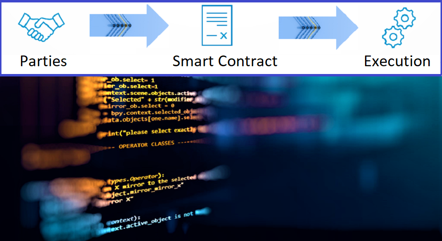

# Smart Contract using Ether BlockChain for Portfolio Recommendations
*In this project we're going to setup a smart contract on Ethereum blockchain and use this contract to give away portfolio recommendations to our potential customers. This particular contract is made for Customers who wants to transfer ethereum instead of USD for portfolio recommendations.*

# Smart Contract Solidity

# Python Project 2 Files
